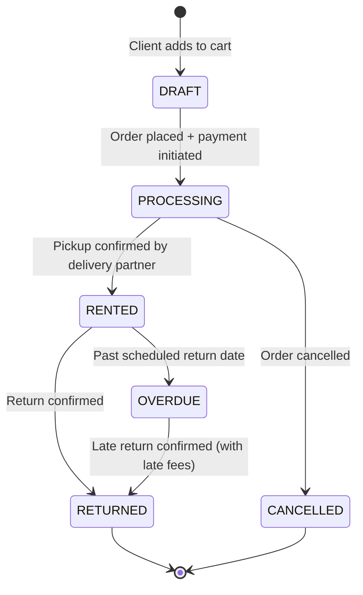

<p align="center">
  
</p>

<h1 align="center">
  🎯 RentalOps
</h1>

<p align="center">
  <strong>A full-stack, end-to-end equipment rental management platform</strong><br/>
  <em>Built for the Odoo Hackathon 2026 — covering the complete rental lifecycle from catalog to return</em>
</p>

<p align="center">
  
  
  
  
  
  
  
</p>

---

## 🌟 Overview

**RentalOps** is a comprehensive rental management system that handles the complete lifecycle of equipment rentals — from product listing and customer onboarding through quotations, orders, payments, pickup/return workflows, and invoicing — all from a single, unified platform.

The system supports **three distinct user roles**: Vendor (admin dashboard), Client (customer portal), and Delivery Partner (logistics app). Each role has a dedicated interface tailored to their workflow, backed by a single robust Express + PostgreSQL API.

Key highlights:
- 🛒 **Full rental catalog** with variants, attributes, price lists, and coupon support
- 📋 **Quotation-to-order pipeline** with customizable templates
- 💳 **Razorpay payment integration** with security deposit invoicing
- 🚚 **Delivery partner portal** for pickup & return task management
- 📊 **Vendor analytics dashboard** with order and revenue insights
- 🔔 **Real-time notifications** via Socket.IO
- 🗓️ **Rental scheduler** with conflict detection

---

## 🏗️ Architecture

```
Odoo_finals/
├── Frontend/                          # React 19 + Vite + Tailwind CSS 4
│   └── src/
│       ├── api/                       # Axios instance, endpoints, service layers
│       │   ├── axiosInstance.js       # Interceptors + auto token refresh
│       │   ├── endpoints.js           # Centralized API URL constants + getImageUrl()
│       │   ├── productService.js
│       │   ├── orderService.js
│       │   ├── paymentService.js
│       │   └── ...
│       ├── components/
│       │   ├── common/                # Shared UI (modals, signature pad, etc.)
│       │   ├── layout/                # App shell layouts (portal, backend, delivery)
│       │   └── portal/catalog/        # Product cards, filters, catalog grid
│       ├── context/                   # Auth, Cart, Notification React contexts
│       ├── pages/
│       │   ├── Landing.jsx            # Public marketing landing page
│       │   ├── backend/               # Vendor dashboard pages (11 pages)
│       │   │   ├── DashboardPage.jsx
│       │   │   ├── OrdersPage.jsx / OrderDetailPage.jsx
│       │   │   ├── ProductsPage.jsx / ProductFormPage.jsx
│       │   │   ├── QuotationsPage.jsx / QuotationTemplatesPage.jsx
│       │   │   ├── WorkflowsPage.jsx  # Pickup & return management
│       │   │   ├── DeliveryPartnersPage.jsx
│       │   │   ├── QueriesPage.jsx
│       │   │   └── ProfilePage.jsx
│       │   ├── portal/                # Client-facing pages (27 pages)
│       │   │   ├── HomePage.jsx / LoginPage.jsx / SignupPage.jsx
│       │   │   ├── ProductDetailPage.jsx
│       │   │   ├── CartPage.jsx / CheckoutAddressPage.jsx / CheckoutPaymentPage.jsx
│       │   │   ├── MyOrdersPage.jsx / OrderDetailPage.jsx
│       │   │   ├── VendorDashboard.jsx / VendorProducts.jsx
│       │   │   ├── VendorSettingsPage.jsx
│       │   │   ├── ReportsPage.jsx / RentalSchedulerPage.jsx
│       │   │   ├── InvoicePage.jsx / ClientQuotationPage.jsx
│       │   │   ├── SupportPage.jsx / QueriesPage.jsx
│       │   │   └── WorkflowsPage.jsx
│       │   └── delivery/              # Delivery partner portal (3 pages)
│       │       ├── DeliveryLoginPage.jsx
│       │       ├── DeliveryDashboardPage.jsx
│       │       └── TaskDetailPage.jsx
│       ├── routes/                    # React Router v7 route definitions
│       └── services/                  # Business logic helpers
│
├── backend/                           # Express.js 5 REST API
│   ├── server.js                      # HTTP server entry point (port 5001)
│   ├── prisma/
│   │   ├── schema.prisma              # Full data model (30+ models, 15+ enums)
│   │   ├── seed.js                    # Demo data seeder (vendor, client, 15 products)
│   │   └── prisma.config.cjs
│   ├── src/
│   │   ├── app.js                     # Express app: CORS, static uploads, routes
│   │   ├── config/db.js               # Prisma client + pg adapter
│   │   ├── routes/                    # 26 route files
│   │   │   ├── auth.routes.js         # Client / Vendor / Delivery auth
│   │   │   ├── products.routes.js
│   │   │   ├── orders.routes.js
│   │   │   ├── quotations.routes.js / quotationTemplates.routes.js
│   │   │   ├── payments.routes.js     # Razorpay order creation + verification
│   │   │   ├── invoices.routes.js / depositInvoices.routes.js
│   │   │   ├── workflow.routes.js     # Pickup & return workflow
│   │   │   ├── cart.routes.js / wishlist.routes.js
│   │   │   ├── priceLists.routes.js / coupons.routes.js
│   │   │   ├── attributes.routes.js / categories.routes.js
│   │   │   ├── clients.routes.js / vendors.routes.js
│   │   │   ├── deliveryPartners.routes.js
│   │   │   ├── notifications.routes.js
│   │   │   ├── upload.routes.js       # Multer file upload
│   │   │   ├── dashboard.routes.js
│   │   │   ├── queries.routes.js      # Support queries
│   │   │   ├── scheduler.routes.js
│   │   │   ├── settings.routes.js
│   │   │   └── addresses.routes.js
│   │   ├── controllers/               # Request handlers (1:1 with routes)
│   │   ├── services/                  # Business logic layer
│   │   ├── repositories/              # Prisma data access layer
│   │   ├── middlewares/
│   │   │   ├── authenticate.js        # JWT verification
│   │   │   ├── authorize.js           # Role-based guards
│   │   │   ├── scopeToVendor.js       # Vendor data isolation
│   │   │   ├── validate.js            # Zod schema validation
│   │   │   └── errorHandler.js
│   │   ├── validators/                # Zod schemas
│   │   └── utils/
│   └── uploads/                       # Product image storage (served as static)
│
└── package.json                       # Root workspace config
```

---

## 🔐 User Roles & Access

RentalOps has **three distinct user types**, each with a separate auth flow and interface:

| Role | Interface | Key Capabilities |
|---|---|---|
| **Vendor** | `/backend/*` dashboard | Manage products, orders, quotations, pricing, delivery partners, analytics |
| **Client** | `/portal/*` storefront | Browse catalog, cart, checkout, pay, track orders, raise support |
| **Delivery Partner** | `/delivery/*` portal | View assigned tasks, confirm pickup/return, update workflow status |

---

## 🔄 Rental Order Lifecycle



**Automated side-effects:**
- **Order Placed**: Security deposit invoice created (50% of rental value by default)
- **Razorpay Payment**: Amount verified server-side via webhook signature
- **Pickup Confirmed**: Rental timer starts, product status → `RENTED`
- **Return Confirmed**: Final invoice generated, late fee calculated if overdue
- **Late Return**: Auto late-fee applied per vendor's configured rate/hour

---

## 🚀 Quick Start

### Prerequisites

- **Node.js** ≥ 18
- **PostgreSQL** 15+
- **npm**

### 1. Clone & Install

```bash
git clone https://github.com/MaitraAmbalia/Odoo_finals.git
cd Odoo_finals

# Backend
cd backend && npm install

# Frontend
cd ../Frontend && npm install
```

### 2. Environment Variables

Create a `.env` file inside `/backend`:

```env
PORT=5001
NODE_ENV=development

DATABASE_URL=postgresql://<user>:<password>@localhost:5432/rental_db

ACCESS_TOKEN_SECRET=your_access_secret
ACCESS_TOKEN_EXPIRY=15m
REFRESH_TOKEN_SECRET=your_refresh_secret
REFRESH_TOKEN_EXPIRY=7d

COOKIE_SECRET=your_cookie_secret
CLIENT_URL=http://localhost:5173
UPLOAD_DIR=uploads

# Razorpay
RAZOR_PAY_KEY_ID=rzp_test_xxxxxxxxxxxx
RAZOR_PAY_HEY_SECRET=your_razorpay_secret
```

### 3. Database Setup & Seed

```bash
cd backend

# Push Prisma schema to DB (creates all tables)
npx prisma generate
npx prisma db push

# Seed demo data (vendor, client, 15 products + mock orders)
node prisma/seed.js
```

### 4. Run

```bash
# Terminal 1 — Backend (port 5001)
cd backend && npm run dev

# Terminal 2 — Frontend (port 5173)
cd Frontend && npm run dev
```

Open **[http://localhost:5173](http://localhost:5173)**

---

## 🧪 Demo Accounts

| Role | Email | Password |
|---|---|---|
| Vendor | `vendor@example.com` | `Pass@123_` |
| Client | `client@example.com` | `Pass@123_` |

---

## 📡 API Reference

All routes are prefixed with `/api`. Backend runs on **port 5001**.

### Authentication
| Method | Endpoint | Description |
|---|---|---|
| `POST` | `/auth/client/register` | Register new client |
| `POST` | `/auth/client/login` | Client login → JWT cookies |
| `POST` | `/auth/vendor/login` | Vendor login → JWT cookies |
| `POST` | `/auth/delivery/login` | Delivery partner login |
| `GET` | `/auth/me` | Get current authenticated user |

### Products & Catalog
| Method | Endpoint | Description |
|---|---|---|
| `GET` | `/products` | List all published products (filterable) |
| `GET` | `/products/:id` | Get product details + variants |
| `POST` | `/products` | Create product (Vendor) |
| `PATCH` | `/products/:id` | Update product (Vendor) |
| `DELETE` | `/products/:id` | Delete product (Vendor) |
| `GET/POST` | `/categories` | List / Create categories |
| `GET/POST` | `/attributes` | List / Create attributes + values |

### Orders & Checkout
| Method | Endpoint | Description |
|---|---|---|
| `GET/POST` | `/orders` | List orders / Create new order |
| `GET` | `/orders/:id` | Get order details |
| `PATCH` | `/orders/:id/status` | Update order status |
| `POST` | `/cart/apply-coupon` | Validate and apply coupon code |

### Payments & Invoicing
| Method | Endpoint | Description |
|---|---|---|
| `POST` | `/orders/:id/payments/razorpay-order` | Create Razorpay payment order |
| `POST` | `/payments/verify` | Verify Razorpay payment signature |
| `GET` | `/invoices` | List invoices |
| `GET` | `/deposit-invoices` | List security deposit invoices |

### Quotations
| Method | Endpoint | Description |
|---|---|---|
| `GET/POST` | `/quotations` | List / Create quotations |
| `PATCH` | `/quotations/:id/status` | Accept / Reject quotation |
| `GET/POST` | `/quotation-templates` | Manage quotation templates |

### Pickup & Return Workflow
| Method | Endpoint | Description |
|---|---|---|
| `GET` | `/workflows` | List all pickup/return workflows |
| `POST` | `/workflows/:id/confirm-pickup` | Confirm item pickup |
| `POST` | `/workflows/:id/confirm-return` | Confirm item return |

### Vendor & Settings
| Method | Endpoint | Description |
|---|---|---|
| `GET` | `/vendors/me` | Get vendor profile |
| `GET/PATCH` | `/settings` | Get / Update vendor settings (late fees, tax, deposit) |
| `GET` | `/dashboard` | Vendor KPI analytics |
| `GET/POST` | `/price-lists` | Manage pricing rules |
| `GET/POST` | `/coupons` | Manage discount coupons |

### Delivery Partners
| Method | Endpoint | Description |
|---|---|---|
| `GET/POST` | `/delivery-partners` | List / Register delivery partners |
| `GET` | `/delivery-partners/tasks` | Get assigned delivery tasks |

### Misc
| Method | Endpoint | Description |
|---|---|---|
| `POST` | `/upload` | Upload product images (Multer) |
| `GET/POST` | `/queries` | Customer support queries |
| `GET` | `/notifications` | User notifications |
| `GET` | `/addresses` | Saved client addresses |

---

## 🛠️ Tech Stack

| Layer | Technology | Version |
|---|---|---|
| **Frontend** | React | 19 |
| **Build Tool** | Vite | 8 |
| **Styling** | Tailwind CSS | 4 |
| **Routing** | React Router | v7 |
| **HTTP Client** | Axios | 1.x |
| **Icons** | Lucide React | 1.x |
| **Backend** | Express.js | 5 |
| **Database** | PostgreSQL | 15 |
| **ORM** | Prisma | 7 |
| **Auth** | JWT (access + refresh tokens) | — |
| **Validation** | Zod | 3 |
| **Payments** | Razorpay | 2.x |
| **File Upload** | Multer | 1.x |
| **Logging** | Morgan + Winston | — |
| **Real-time** | Socket.IO | 4.x |
| **PDF Generation** | PDFKit | 0.16 |
| **Excel Export** | ExcelJS | 3.x |
| **Scheduling** | node-cron | 4.x |
| **Security** | Cookie-parser + CORS + JWT rotation | — |

---

## 🗄️ Data Model Highlights

The Prisma schema defines **30+ models** covering the full rental domain:

- `Vendor`, `Client`, `DeliveryPartner` — user entities
- `Product`, `ProductVariant`, `ProductCategory`, `Attribute`, `AttributeValue` — catalog
- `PriceList`, `PriceListRule`, `Coupon`, `CouponRedemption` — pricing engine
- `Cart`, `CartItem`, `WishlistItem` — shopping experience
- `Quotation`, `QuotationItem`, `QuotationTemplate`, `QuotationTemplateLine` — B2B quoting
- `Order`, `OrderItem` — rental orders
- `Payment`, `Invoice`, `InvoiceLine`, `SecurityDepositInvoice` — financials
- `PickupReturnWorkflow` — logistics tracking
- `SupportQuery`, `Notification`, `RefreshToken` — operations
- `VendorSettings` — per-vendor config (late fees, tax %, deposit rules)

---

## 📄 License

This project was built for the **Odoo x KSV Hackathon 2026**.

